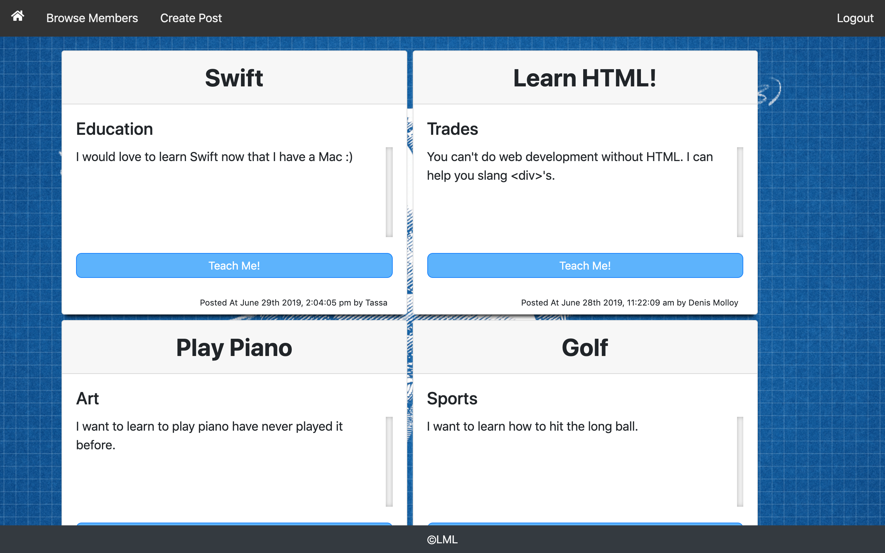
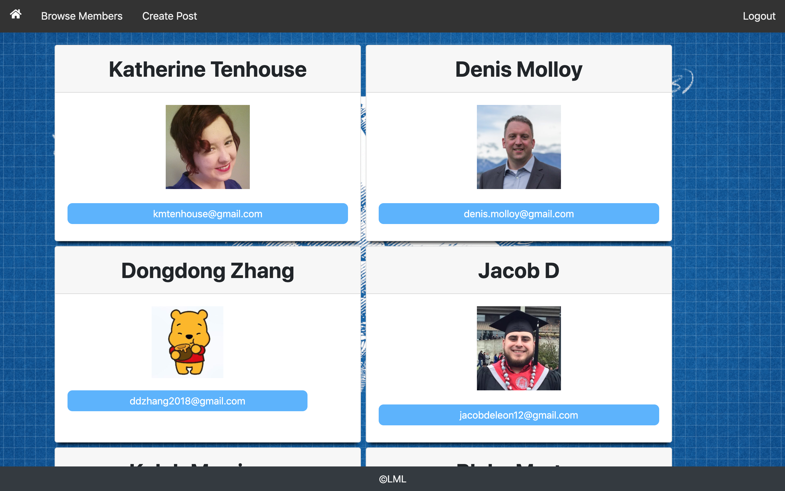

# Let Me Learn 

### Link to Let Me Learn 
https://rocky-tor-86904.herokuapp.com/

### Team Members
- Blake M.
- Dongdong Z.
- Jacob D. 
- Kaleb M. 

### App Description
Let Me Learn is a secure platform and place where those who want to learn and those willing to teach can meet. 
- Want to learn how to golf or cook or code? Make a post to see if anyone is willing to teach you, or browse our list of teachers in your desired area of learning!
- Good at something and want to teach and make the world a better place? Create a profile with what qualifies you as a “teacher” and your availability, then start searching through posts to find your student!

Both teachers and students will have a rating/review of how their experience was with the other individual.

### Motivation for Creation 
We all have things in life that we would like to be better at that don’t really have the most traditional ways of being taught and/or you don’t want to take actual classes that are expensive or you don’t have time for. (example: skateboarding, organizational skills, how to build a bookshelf.)

### How to Use Let Me Learn 
First, open up the page and login with Google. After you enter all the information, you will be taken to the homepage.

 

Second, in the homepage, you can view all the students' posts (including post title, category, and description). Click on the button `Teach Me!` if you have the skill, and you can directly email the other individual from there. 

 

Third, if you want to become a student, you can click on the button `Create Post` and fill out the form. Please notice that all fields are required. After that you will be taken to our homepage where your post is attached to the top. 

 

Fourth, you can browse all our members by clicking on the `Browse Members` button. 

 

Finally, click on the `Logout` button that is at the top right corner to logout the page. 

### Technologies Used 
- HTML5, CSS, JavaScript, jQuery
- Node.js
- MySQL
- Sequelize
- Handlebars

### Future Development 
We are looking to develop the following aspects of our app in the future: 

- Build two seperate user terminals for students and teachers
- When an agreement is reached between a pair, they can book an appointment using calendly on our app 
- For safety reasons, we need to monitor the conversation between pairs. So we may need to build a built-in chat box and require mandatory usage. We may also need a screening procedure. 
- We haven’t developed a business model for our app. Our initial idea is to either have a bidding system for the skills or to have a “trading” system where users can trade their skills. 
- Both teachers and students will have a rating/review of how their experience was with the other individual.

### Role & Contact Information
Dongdong Z. : Front-end Lead Developer & UI/UX Designer 

General inquiries at ddzhang2018@gmail.com.

